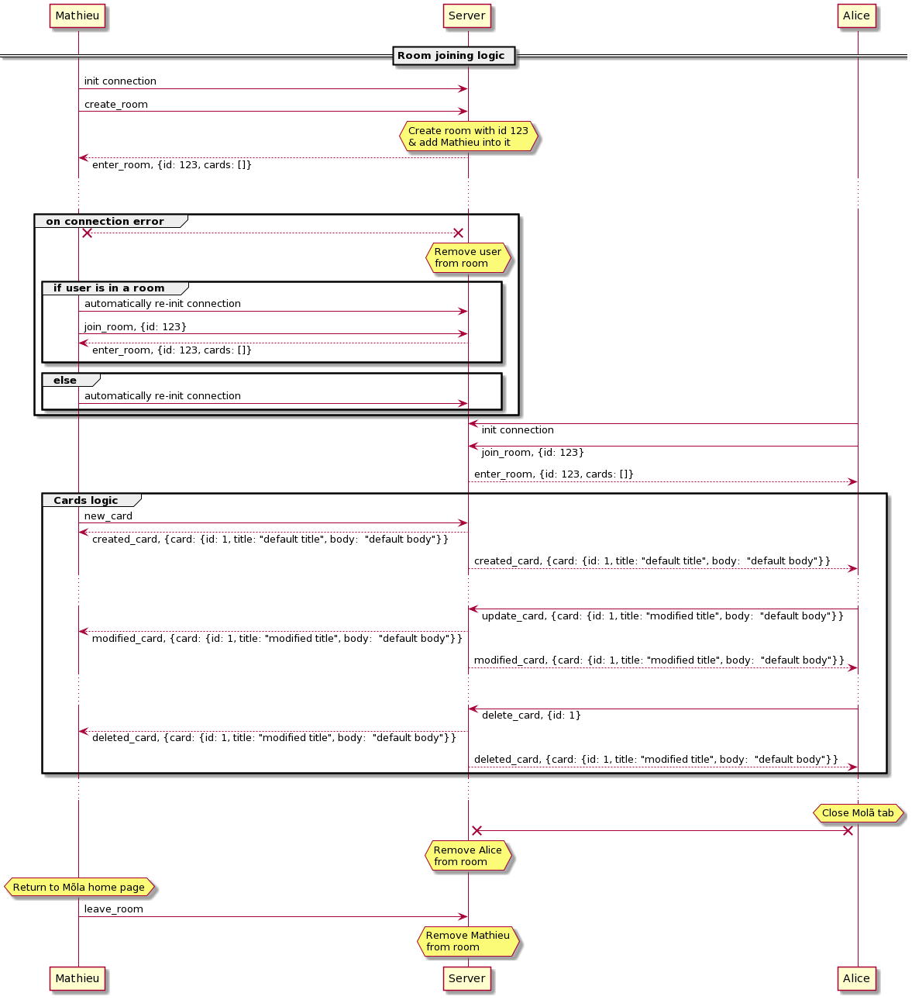

# Mõla 
Mr Jacquet's project for the course "Conception d'application mobile", UNamur BE.


### Getting started

> Development environment

Client side, using NPM :

```bash
cd client 
npm install && npm run dev
```

Server side, using SBT :

```bash
cd server && sbt run
```

You can then go to your [localhost](http://localhost:5000/) on port 5000.


### Websockets communication

TODO :



